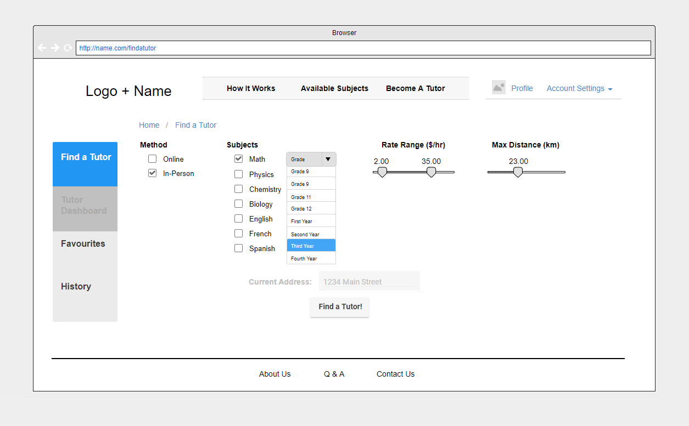
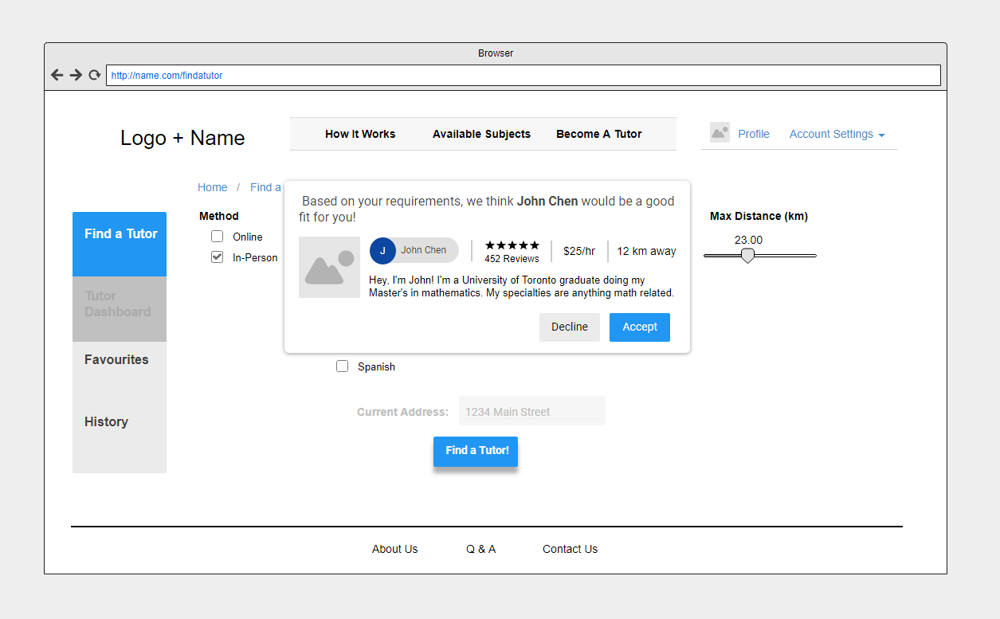

# FindATutor
A third year web application that lets students connect with tutors. By Ibad Haider, Keenan Kua, Moulik Gaglani, Paul Chung, and Sheheryar Butt. Back-end was developed using PHP and SQL and front-end using HTML and Bootstrap.

SCREENSHOTS
------------

Mockups
--------

TO NOTE
--------
My main responsibility was the front end of the web application. I chose to use Bootstrap as it allowed for easy scalability of our application. I had worked with HTML before but not Bootstrap so it was a great learning experience.

